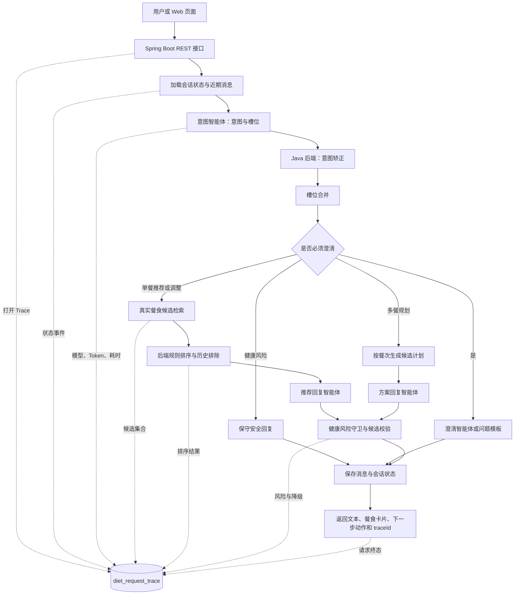

# Diet-Agent V2 第一阶段（Skill + 统一工具注册中心）

本分支在 V1 的确定性编排基础上，已实现 Skill 资源解析、固定意图路由、按需加载、工具授权和工具调用 Trace。V2 的上下文工程、长期记忆、MCP、PostgreSQL + pgvector 和分布式并发治理仍未实现。

基于 Java、Spring Boot 与 AgentScope 构建的多轮饮食推荐智能体。系统采用“**Java 确定性编排 + 专业智能体推理**”的分层架构，将意图理解、槽位澄清、真实候选检索、规则排序、回复生成、健康风险控制、链路追踪和离线评估组合成一条可回溯的业务链路。

> 当前仓库在 V1 业务闭环上已实现 V2 第一阶段的 Skill 与统一工具注册中心；MCP、PostgreSQL + pgvector、跨会话长期记忆等内容仍未包含在当前代码中。

## 目录

- [项目解决什么问题](#项目解决什么问题)
- [核心能力](#核心能力)
- [系统架构](#系统架构)
- [一次请求如何执行](#一次请求如何执行)
- [关键设计](#关键设计)
- [技术栈](#技术栈)
- [项目结构](#项目结构)
- [快速开始](#快速开始)
- [核心接口](#核心接口)
- [当前限制](#当前限制)
- [V2 演进方向](#v2-演进方向)

## 项目解决什么问题

饮食推荐不是简单的一问一答。真实用户经常只说“随便吃点”“换一个”或“早餐简单点”，系统需要处理：

- 输入省略、多轮承接和偏好覆盖；
- 推荐必须来自公共餐食库或当前用户的个人餐食库；
- 大模型可能超时、输出非法 JSON 或返回不存在的餐食编号；
- 健康风险、极端节食和治疗承诺不能只依赖模型自觉规避；
- 出现低质量结果时，需要知道问题发生在意图、槽位、检索、排序还是生成阶段。

Diet-Agent 的处理原则是：**模型负责语义理解和语言生成，Java 后端负责业务状态、数据权限、真实候选、规则决策和异常兜底。**

## 核心能力

| 能力 | V1 实现方式 |
|---|---|
| 多轮对话 | 持久化会话阶段、当前意图、七维槽位、最近消息和历史推荐编号 |
| 意图理解 | 意图智能体输出结构化结果，后端结合会话状态二次矫正 |
| 槽位澄清 | 槽位合并后由后端规则判断是否必须追问，澄清智能体负责自然语言表达 |
| 饮食推荐 | 从公共库或个人库检索真实候选，规则排序后再交给模型生成解释 |
| 饮食调整 | 继承上一轮有效条件，合并本轮新要求，并排除近期推荐 |
| 多餐规划 | 按餐次检索和组织候选，由方案回复智能体生成整体说明 |
| 幻觉控制 | 最终餐食编号必须属于后端提供的候选集合，不允许模型创建业务编号 |
| 健康风险 | 后端风险守卫检查用户输入和最终回复，命中规则时替换为保守提示 |
| 异常兜底 | 模型调用或结构解析异常时，由关键词规则、排序结果和回复模板接管 |
| 全链路追踪 | 按一次请求记录状态机事件、模型调用、Token、耗时、异常和最终结果 |
| 离线评估 | 综合后端规则、大模型裁判和用户反馈生成百分制评估报告 |

## 系统架构



### 组件职责

| 组件 | 职责 | 是否决定业务流程 |
|---|---|---|
| `DietOrchestratorService` | 驱动状态机、选择分支、组织服务调用、保存状态 | 是 |
| 意图智能体 | 识别本轮意图、置信度和七维槽位 | 否 |
| 澄清智能体 | 将后端确定的缺失槽位组织成自然问题 | 否 |
| 推荐回复智能体 | 基于真实候选生成推荐理由和回复 | 否 |
| 方案回复智能体 | 基于多餐候选生成计划说明 | 否 |
| 评估裁判智能体 | 离线评价解释质量和自然度 | 否，不参与在线路由 |
| 规则服务 | 意图矫正、澄清判断、排序、风险控制和合法性校验 | 是 |

在线会话中的四个 ReActAgent 按会话创建并缓存，缓存最多保留 1000 组，按最近最少使用策略淘汰。评估裁判智能体独立用于离线评估。

## 一次请求如何执行

以用户输入“换一个清淡点的”为例：

1. 接口读取 `X-User-Id` 和请求中的 `sessionId`、`message`、`sourceMode`。
2. 后端加载会话阶段、上一轮意图、已合并槽位和历史推荐编号。
3. 意图智能体识别 `MEAL_ADJUST`，并抽取“清淡”口味槽位。
4. 后端检查当前会话是否存在可调整的上一轮推荐：
   - 存在：继承有效条件并进入调整流程；
   - 不存在：不凭空猜测调整对象，转为澄清或普通推荐。
5. 系统从选定数据源检索真实餐食，排除近期推荐，再按槽位匹配规则排序。
6. 推荐回复智能体只能基于排序后的候选生成理由；返回编号会再次经过集合校验。
7. 健康风险守卫检查最终文本，必要时替换为保守回复。
8. 保存用户消息、助手消息和会话状态，并将整轮事件写入 Trace。
9. 返回 `speechText`、`displayBlocks`、`nextAction` 和 `traceId`。

## 关键设计

### 1. 六类意图与七维槽位

当前状态机支持六类意图：

| 意图 | 含义 |
|---|---|
| `MEAL_RECOMMENDATION` | 请求单餐推荐 |
| `CLARIFY_NEEDED` | 有饮食诉求，但关键信息不足 |
| `MEAL_ADJUST` | 基于上一轮推荐要求更换或调整 |
| `MEAL_PLAN` | 请求早餐、午餐、晚餐等多餐规划 |
| `HEALTH_RISK` | 涉及医疗诊断、治疗承诺或极端节食等风险 |
| `OTHER` | 与饮食无关的输入 |

七维槽位用于表达结构化需求：

| 槽位 | 示例 |
|---|---|
| `mealTime` | 早餐、午餐、晚餐 |
| `mood` | 开心、疲惫、压力大 |
| `scene` | 一人食、聚餐、工作日 |
| `healthGoal` | 控糖、减脂、增肌 |
| `cuisine` | 中式、西式、川菜 |
| `taste` | 清淡、酸辣、偏甜 |
| `convenience` | 快手、可外卖、适合备餐 |

槽位值来自数据库标准词典。模型负责从自然语言中提取候选值，后端负责归一化、合并、去重和多轮覆盖。

### 2. 确定性编排，而不是智能体自由协商

项目使用多个专业智能体，但它们不会互相自由对话决定下一步。在线链路的执行顺序、业务分支和状态跃迁由 `DietOrchestratorService` 统一控制。

这种设计的原因是：

- 同一业务状态应产生可预测的下一步；
- 数据归属、餐食编号和风险边界需要确定性校验；
- 每个智能体可以独立设置提示词、模型与结构化协议；
- Trace 能准确解释每个决策发生在哪一层。

### 3. 真实候选与幻觉控制

推荐链路遵循“**先查真实数据，再让模型组织表达**”：

1. `MealSearchService` 按公共库或个人库、七维标签和排除编号检索候选；
2. `MealRankService` 根据槽位匹配度和历史排除进行排序；
3. 回复智能体只接收有限候选的编号、名称和标签；
4. 后端校验模型返回编号是否属于候选集合；
5. 候选为空或编号非法时使用规则结果或固定引导，不允许模型补造餐食。

个人餐食查询始终携带当前 `userId`，公共模式和个人模式通过 `SourceMode.PUBLIC`、`SourceMode.PERSONAL` 显式区分。

### 4. 多轮状态

`SessionState` 保存：

- 当前会话阶段；
- 当前意图与数据源模式；
- 已合并的七维槽位；
- 最近推荐编号；
- 最近消息记录。

新一轮槽位与旧状态合并时，用户本轮明确表达优先于历史信息；调整场景还会排除已推荐餐食，减少连续返回相同结果。

### 5. 大模型异常兜底

Fallback 按节点设计，而不是只在接口最外层返回“系统繁忙”：

| 异常节点 | 接管方式 |
|---|---|
| 意图识别 | 使用关键词规则得到保守意图，无法确定时进入澄清 |
| 槽位抽取 | 丢弃非法值，保留已有合法槽位 |
| 澄清生成 | 根据缺失槽位生成固定问题模板 |
| 推荐回复 | 使用规则排序结果和模板理由生成回复 |
| 多餐计划回复 | 使用结构化计划和模板生成说明 |
| 健康风险 | 用后端保守文案替换高风险输出 |
| 评估裁判 | Judge 失败时不阻断规则评估和反馈评估 |

当前实现主要覆盖模型调用异常和结构解析异常；显式超时、重试、熔断等统一治理属于后续演进内容。

### 6. 全链路 Trace

每轮请求创建一个 `traceId`，`AgentTraceService` 使用请求线程内的 `TraceScope` 收集事件，并在请求结束时统一写入 `diet_request_trace`。

典型事件包括：

- 请求接收、完成与失败；
- 用户消息记录与会话状态变化；
- 意图识别、意图矫正、槽位合并和澄清决策；
- 餐食检索、规则排序和推荐结果；
- Agent 名称、模型名称、输入输出摘要、Token 和耗时；
- 风险守卫、降级路径和最终回复。

Trace 支持按 `traceId`、`sessionId` 或时间范围查询，也支持写入人工期望意图、期望槽位和期望澄清动作，用于离线评估。

### 7. 离线评估闭环

离线评估批量解析 Trace，并组合三类信号：

- **后端规则（默认权重 60%）**：意图准确率、槽位准确率、澄清必要性、Token 成本分、延迟分、降级分、安全合规、幻觉控制和多轮一致性；
- **大模型裁判（默认权重 10%）**：解释质量和自然度；
- **用户反馈（默认权重 30%）**：评分、采纳和反馈行为。

缺少某类信号时，评分只在现有分组之间重新归一化。评估结果既包含总分，也保留单项指标、预测值、人工标注和 Judge 原因，便于将低分样本回流到提示词、规则和数据修正。

需要注意：当前反馈表没有直接保存 `traceId`，同一会话内的反馈采用近似归因；当前 `fallbackScore` 只区分是否发生降级，还没有评价降级回复本身的质量。

## 技术栈

| 类别 | 技术 |
|---|---|
| 语言与运行时 | Java 21 |
| Web 框架 | Spring Boot 3.3.13 |
| 智能体框架 | AgentScope Java 1.0.11 |
| 大模型 | DashScope，默认 `qwen-max` / `qwen-turbo` |
| 数据访问 | MyBatis Spring Boot Starter 3.0.4 |
| 数据库 | MySQL 8 |
| 前端 | 原生 HTML、CSS、JavaScript |
| 构建工具 | Maven |

## 项目结构

```text
DietAgent/
├─ pom.xml
├─ README.md
└─ src/main/
   ├─ java/com/diet/
   │  ├─ agent/             # ReActAgent 构建器、提示词加载与会话级工厂
   │  ├─ config/            # DashScope 与模型 Bean 配置
   │  ├─ controller/        # 对话、餐食、会话、Trace、反馈和评估接口
   │  ├─ enums/             # 意图、会话阶段、风险等级和数据源模式
   │  ├─ mapper/            # MyBatis Mapper 接口
   │  ├─ model/             # 请求、响应、状态、槽位和评估模型
   │  ├─ service/
   │  │  ├─ orchestrator/   # 核心状态机与业务编排
   │  │  ├─ intent/         # 意图识别与后端矫正
   │  │  ├─ clarify/        # 澄清规则和澄清生成
   │  │  ├─ meal/           # 餐食查询、排序和管理
   │  │  ├─ recommend/      # 单餐推荐回复
   │  │  ├─ plan/           # 多餐规划回复
   │  │  ├─ risk/           # 健康风险守卫
   │  │  ├─ session/        # 会话、消息与状态持久化
   │  │  ├─ trace/          # 全链路事件采集与查询
   │  │  └─ evaluation/     # 规则、Judge 与反馈组合评估
   │  └─ util/              # JSON 解析和槽位辅助工具
   └─ resources/
      ├─ application.yml    # 环境变量与默认配置
      ├─ db/diet_db.sql     # 六张核心表及初始化数据
      ├─ diet/prompts/      # 各专业智能体提示词
      ├─ mapper/            # MyBatis XML
      └─ static/            # 内置调试与演示页面
```

## 快速开始

### 1. 环境要求

- JDK 21
- Maven 3.9+
- MySQL 8.x
- 可用的 DashScope API Key

### 2. 初始化数据库

SQL 脚本不会自动创建数据库，请先创建 `diet_db`，再导入脚本。

```sql
CREATE DATABASE IF NOT EXISTS diet_db
  CHARACTER SET utf8mb4
  COLLATE utf8mb4_unicode_ci;
```

Bash：

```bash
mysql -u root -p diet_db < src/main/resources/db/diet_db.sql
```

PowerShell：

```powershell
Get-Content -Raw src/main/resources/db/diet_db.sql | mysql -u root -p diet_db
```

脚本包含六张核心表：`diet_sessions`、`diet_messages`、`diet_request_trace`、`diet_slot_option`、`meal_item`、`recommend_feedback`。

### 3. 配置环境变量

必需配置：

| 环境变量 | 说明 |
|---|---|
| `DIET_DB_PASSWORD` | MySQL 密码 |
| `DASHSCOPE_API_KEY` | DashScope API Key |

可选配置：

| 环境变量 | 默认值 | 说明 |
|---|---|---|
| `DIET_DB_URL` | `jdbc:mysql://localhost:3306/diet_db?...` | JDBC 地址 |
| `DIET_DB_USERNAME` | `root` | MySQL 用户名 |
| `SERVER_PORT` | `8080` | HTTP 端口 |
| `DIET_MAIN_MODEL` | `qwen-max` | 推荐和方案回复模型 |
| `DIET_LIGHT_MODEL` | `qwen-turbo` | 意图和澄清模型 |
| `DIET_MAX_HISTORY_TURNS` | `10` | 读取的历史消息上限 |

Bash：

```bash
export DIET_DB_PASSWORD='your-password'
export DASHSCOPE_API_KEY='your-api-key'
```

PowerShell：

```powershell
$env:DIET_DB_PASSWORD = 'your-password'
$env:DASHSCOPE_API_KEY = 'your-api-key'
```

不要将真实密码和 API Key 写入 `application.yml` 或提交到 Git。

### 4. 构建与启动

```bash
mvn test
mvn spring-boot:run
```

启动后访问：

- Web 页面：<http://localhost:8080/>
- API 前缀：`http://localhost:8080/api/v1/diet`

当前仓库没有 `src/test` 测试源码，因此 `mvn test` 主要验证依赖解析和主代码编译，不能代表已有自动化测试覆盖。

### 5. 最小调用示例

创建会话：

```bash
curl -X POST http://localhost:8080/api/v1/diet/sessions \
  -H "X-User-Id: 1"
```

假设返回：

```json
{
  "sessionId": "替换为实际返回值"
}
```

发送对话：

```bash
curl -X POST http://localhost:8080/api/v1/diet/chat \
  -H "Content-Type: application/json" \
  -H "X-User-Id: 1" \
  -d '{
    "sessionId": "替换为实际返回值",
    "message": "晚饭想吃清淡一点，做起来简单",
    "sourceMode": "PUBLIC",
    "context": {}
  }'
```

响应可能是需要继续补充信息的 `CLARIFY`，也可能是包含文本和餐食卡片的 `ANSWER`：

```json
{
  "sessionId": "...",
  "traceId": "...",
  "responseType": "ANSWER",
  "speechText": "...",
  "displayBlocks": [],
  "nextAction": "WAIT_USER",
  "clarifyQuestion": null,
  "missingSlots": []
}
```

## 核心接口

所有需要用户身份的 V1 接口通过 `X-User-Id` 请求头读取用户编号，本地调试默认值为 `1`。

| 方法 | 路径 | 作用 |
|---|---|---|
| `POST` | `/api/v1/diet/sessions` | 创建会话 |
| `POST` | `/api/v1/diet/chat` | 执行一轮多轮对话 |
| `GET` | `/api/v1/diet/slot-options` | 查询标准槽位词典 |
| `GET` | `/api/v1/diet/meals/public` | 查询公共餐食 |
| `GET` | `/api/v1/diet/meals/personal` | 查询当前用户个人餐食 |
| `POST` | `/api/v1/diet/meals/personal` | 新增个人餐食 |
| `PUT` | `/api/v1/diet/meals/personal/{mealId}` | 修改个人餐食 |
| `DELETE` | `/api/v1/diet/meals/personal/{mealId}` | 删除个人餐食 |
| `POST` | `/api/v1/diet/feedback` | 保存推荐反馈 |
| `GET` | `/api/v1/diet/debug/traces/{traceId}` | 查询单条 Trace |
| `GET` | `/api/v1/diet/debug/sessions/{sessionId}/traces` | 查询会话 Trace |
| `GET` | `/api/v1/diet/debug/traces` | 按时间范围批量查询 Trace |
| `PUT` | `/api/v1/diet/debug/traces/{traceId}/label` | 写入人工评估标签 |
| `POST` | `/api/v1/diet/evaluations` | 批量生成离线评估报告 |

## 当前限制

V1 已具备完整业务闭环，但仍有以下工程限制：

1. `X-User-Id` 是本地调试标识，不是真实身份认证，不能直接用于生产环境。
2. 同会话并发通过进程内锁控制，只适用于单实例，无法覆盖多实例并发。
3. 在线 ReActAgent 按会话缓存，存在进程内隐式状态和多实例一致性问题。
4. 历史消息按固定条数和单条字符数裁剪，还没有统一 Token 预算与上下文编译。
5. 当前只有会话内状态，没有经过治理的跨会话长期记忆。
6. Trace 使用线程本地作用域，尚未接入跨线程、跨服务的标准追踪上下文。
7. 反馈按会话近似关联 Trace，降级评分也没有评价兜底回复本身的质量。
8. 当前已补充 Skill、工具策略和编排回归测试；完整的故障注入、Testcontainers 和端到端测试仍属于后续工作。

## V2 演进方向

当前分支已完成 V2 第一阶段：Skill 领域能力和统一工具注册中心。以下内容仍是后续规划：

- 拆分大型编排服务，将智能体改造成无状态执行单元；
- 引入 Token 预算驱动的上下文工程和受控分层记忆；
- 迁移到 PostgreSQL + pgvector，统一关系数据与语义记忆；
- 通过 MCP 标准开放受控的公共只读能力；
- 使用 JWT、请求幂等、会话版本乐观锁和行级安全支持多实例部署；
- 接入 OpenTelemetry、Micrometer、Testcontainers 和完整端到端测试体系；
- 对评估权重、提示词、指标和降级质量进行版本化治理。

V2 的目标不是把系统改成完全自治智能体，而是在保留 V1“模型推理、后端控制”主线的基础上，提高可扩展性、可治理性和分布式运行能力。

## V2 第一阶段实现说明

### Skill 能力

Skill 文件位于 `src/main/resources/diet/skills/`，当前包含：

- `meal-recommendation`：单餐推荐与必要澄清；
- `meal-adjustment`：排除上一轮候选后的调整推荐；
- `meal-planning`：按餐次拆分并生成多餐计划；
- `health-risk-response`：健康风险安全回复。

`SkillRouter` 使用后端固定映射选择 Skill，`SkillLoader` 只在命中后读取正文。Skill 正文只描述领域约束和允许工具，不能覆盖后端状态机、候选 ID 校验或健康风险规则。

### 统一工具注册中心

`DietToolRegistry` 统一处理五类只读业务工具：`search_meals`、`rank_meals`、`get_meal_detail`、`get_slot_options`、`check_health_risk`。调用顺序为：可信上下文校验 → Skill 工具授权 → 参数校验 → `PUBLIC/PERSONAL` 数据隔离 → 现有 Java Service → 结果审计。

工具调用使用后端注入的用户 ID、数据源模式和 Trace ID，不接受模型自行声明的身份信息。Skill 或工具异常时，编排层回退到 V1 的规则和模板路径。

### 新增测试

当前新增 15 个测试，覆盖 frontmatter 解析、Skill 路由和降级、工具授权、个人数据归属、在线编排接入、提示词约束隔离和 Trace 敏感信息过滤。运行命令：

```powershell
& 'D:\diet-agent\.tools\apache-maven-3.9.16\bin\mvn.cmd' '-Dmaven.repo.local=D:\diet-agent\.m2' test
```

## V2 当前实现状态

当前代码已经落地的 V2 能力包括：

- Skill 解析、注册、固定意图路由、按需加载和工具授权；
- 统一工具注册中心、工具 Trace、有限重试和数据归属校验；
- Token 预算驱动的上下文组装、敏感字段过滤和近期对话裁剪；
- 基于 MySQL 的规则校验结构化用户偏好记忆；
- 会话版本号乐观锁；
- 请求幂等键、请求指纹校验和单实例 TTL 去重；
- MCP 只读工具描述、网关和工具发现接口；
- LLM 超时控制、结构化输出边界校验和医疗承诺拦截。

仍未完成的后续能力：

- PostgreSQL + pgvector 语义记忆；
- 完整 MCP stdio/HTTP 协议服务端；
- Redis 或数据库专表实现的跨实例幂等预占与恢复；
- JWT、行级安全策略和 OpenTelemetry 等生产级基础设施。

## License

本项目采用仓库中的 [LICENSE](LICENSE) 许可。
